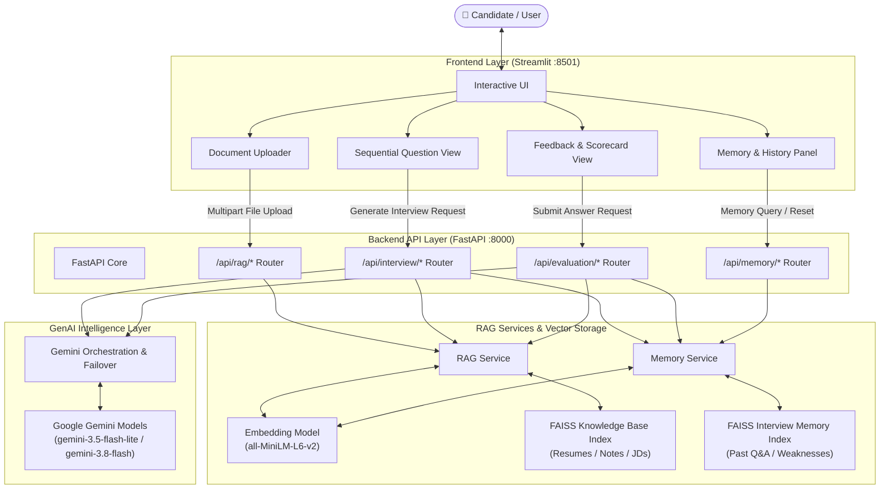
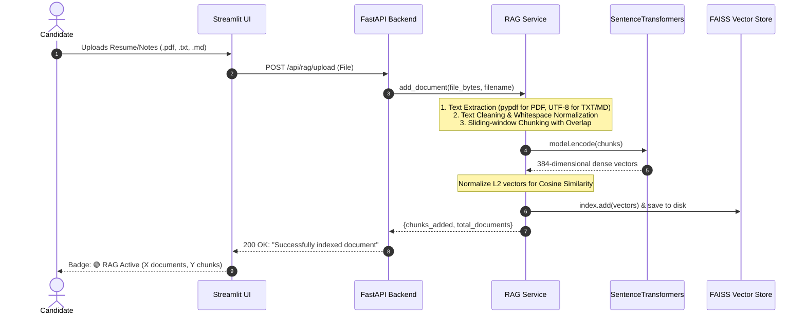
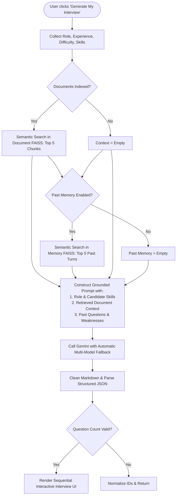
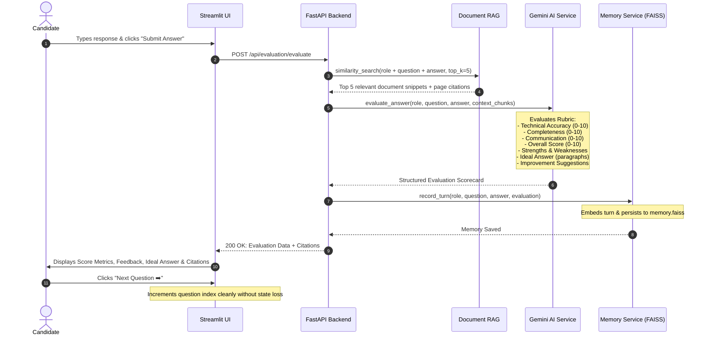
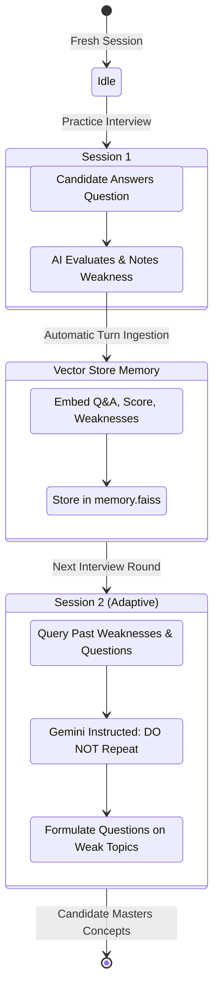

# 🔄 System Workflow & Architecture Documentation

This document provides a comprehensive end-to-end technical overview of the **AI Interview Preparation Agent**, covering the system architecture, the Document RAG pipeline, the Long-Term Interview Memory pipeline, and the user interaction lifecycle.

---

## 1. High-Level System Architecture

---

## 2. Document RAG Pipeline Workflow

The Document RAG pipeline enables the agent to tailor questions and cross-examine answers against external candidate documents (e.g., resumes, job descriptions, technical notes).

---

## 3. Question Generation Workflow (Dual RAG: Documents + Memory)

When generating interview questions, the system combines **candidate preferences**, **retrieved document knowledge**, and **past interview history**.

---

## 4. Answer Evaluation & Memory Ingestion Workflow

---

## 5. RAG Long-Term Memory Lifecycle

---

## 6. API Route Reference

| Method | Endpoint | Description |
| :--- | :--- | :--- |
| `GET` | `/health` | Server health check. |
| `POST` | `/api/interview/generate` | Generates role-specific questions grounded with Document RAG and adapted via Memory RAG. |
| `POST` | `/api/evaluation/evaluate` | Rubric-evaluates candidate response against document context and auto-records to memory. |
| `POST` | `/api/rag/upload` | Extracts, chunks, embeds, and indexes `.pdf`, `.txt`, or `.md` files. |
| `POST` | `/api/rag/search` | Semantic similarity search returning top $k$ chunks with cosine scores. |
| `GET` | `/api/rag/status` | Current count of indexed documents, chunks, and source names. |
| `DELETE` | `/api/rag/clear` | Clears all documents from the vector store. |
| `GET` | `/api/memory/status` | Current count of remembered interview turns and average historical score. |
| `POST` | `/api/memory/search` | Semantic search over previous interview Q&A turns. |
| `DELETE` | `/api/memory/clear` | Clears interview history memory. |
